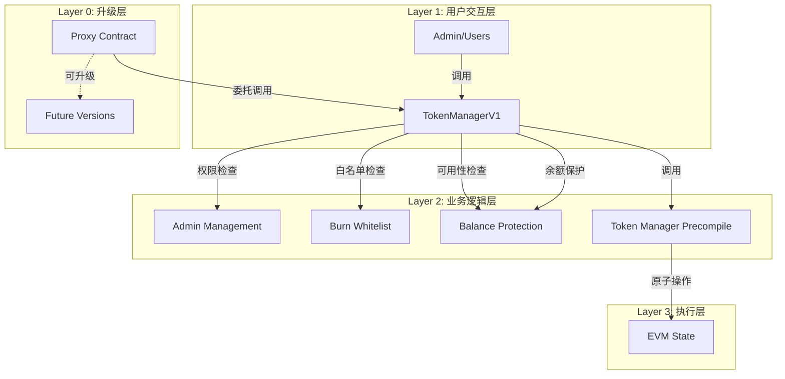
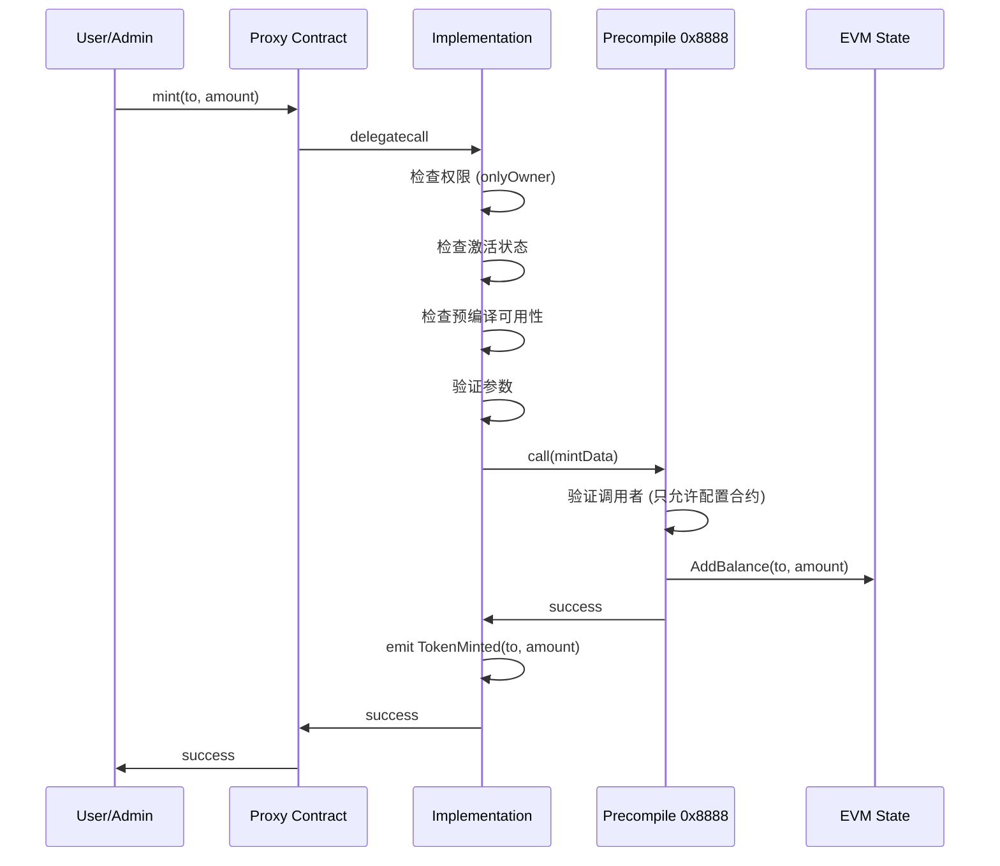

# Token Manager 完整设计文档

## 📋 **目录**

1. [系统概述](#系统概述)
2. [架构设计](#架构设计)
3. [Precompile实现](#precompile实现)
4. [智能合约设计](#智能合约设计)
5. [部署方案](#部署方案)
6. [操作指南](#操作指南)
7. [升级机制](#升级机制)
8. [安全考虑](#安全考虑)
9. [API参考](#api参考)
10. [故障排除](#故障排除)

---

## 🎯 **系统概述**

### **什么是Token Manager**

Token Manager是xlayer-erigon L2链上的原生代币管理系统，采用Precompile + 智能合约的分层架构，提供安全、高效的代币铸造和销毁功能。

### **核心特性**

- 🚀 **高性能**: Precompile实现核心操作，性能卓越
- 🏗️ **分层架构**: Precompile负责原子操作，智能合约负责业务逻辑
- 🔐 **权限控制**: 基于智能合约的灵活权限管理
- 📝 **白名单机制**: 支持burn地址白名单，包括null地址
- 🔄 **可升级性**: 基于OpenZeppelin透明代理模式
- 🛡️ **安全保护**: 防止burn全部余额，避免系统异常
- 🔍 **可用性检查**: 自动检测预编译合约可用性，提供早期故障检测

### **设计原则**

1. **职责分离**: Precompile只负责mint/burn，智能合约负责权限和业务逻辑
2. **安全第一**: 严格的权限控制和输入验证
3. **简洁高效**: 消除重复代码，统一接口设计
4. **可维护性**: 清晰的架构，便于理解和维护

### **系统组件**



---

## 🏗️ **架构设计**

### **总体架构**

Token Manager采用三层架构设计：

#### **1. Precompile层 (0x8888)**
- **职责**: 执行原子的mint/burn操作
- **特点**: 高性能，直接操作EVM状态，框架无关设计
- **限制**: 只接受配置合约的调用
- **文件**: `core/vm/contracts_mint_burn.go`

#### **2. 智能合约层**
- **职责**: 业务逻辑、权限控制、事件发射、预编译可用性检查
- **组件**: 
  - TokenManagerProxy (OpenZeppelin透明代理)
  - TokenManagerV1 (实现合约，基于OpenZeppelin Upgradeable)

#### **3. 用户交互层**
- **工具**: Cast命令行工具
- **接口**: 标准的智能合约调用

### **数据流**



### **地址规划**

| 组件 | 地址 | 说明 |
|------|------|------|
| Precompile | `0x0000000000000000000000000000000000008888` | 固定地址，链启动时生效 |
| 配置合约 | 动态部署 | 通过标准CREATE部署 |
| 代理合约 | 动态部署 | 包含实际的业务逻辑 |

---

## ⚙️ **Precompile实现**

### **核心特性**

1. **地址**: `0x8888` (避免与系统precompile冲突)
2. **权限**: 只接受配置合约的调用
3. **操作**: 支持mint(0x01)和burn(0x02)操作
4. **Gas消耗**: 固定消耗，高性能执行

### **接口规范**

#### **输入格式**
```
[operation:1][address:32][amount:32] (65 bytes total)
```

- `operation`: 1字节操作码
  - `0x01`: mint操作
  - `0x02`: burn操作
- `address`: 32字节地址 (前12字节补零)
- `amount`: 32字节金额 (big-endian编码)

#### **输出**
- 成功: 返回空字节数组 `[]byte{}`
- 失败: 返回error

### **安全机制**

1. **调用者验证**: 
```go
if caller != CONFIG_CONTRACT_ADDRESS {
    return []byte{}, errors.New("unauthorized: only configuration contract can call")
}
```

2. **参数验证**:
```go
if len(input) < 65 {
    return nil, errors.New("invalid data")
}
```

3. **余额检查** (burn操作):
```go
if currentBalance.Cmp(amount) < 0 {
    return nil, fmt.Errorf("insufficient balance")
}
```

### **实现代码结构**

```go
// Framework-agnostic mint/burn precompile
type mintBurnPrecompile struct {
    enabled bool
    evm     *EVM
}

func (c *mintBurnPrecompile) Run(input []byte) ([]byte, error)
func (c *mintBurnPrecompile) handleTokenOperation(operation byte, data []byte) ([]byte, error)
func (c *mintBurnPrecompile) mintTokens(to libcommon.Address, amount *uint256.Int) ([]byte, error)
func (c *mintBurnPrecompile) burnTokens(from libcommon.Address, amount *uint256.Int) ([]byte, error)
```

---

## 💎 **智能合约设计**

### **代理合约 (TokenManagerProxy)**

#### **设计原则**
- 基于OpenZeppelin透明代理模式
- 遵循EIP-1967标准
- 包含完整的安全检查和权限控制

#### **核心功能**
```solidity
contract TokenManagerProxy {
    // EIP-1967 标准存储槽
    bytes32 private constant _IMPLEMENTATION_SLOT = 0x360894a13ba1a3210667c828492db98dca3e2076cc3735a920a3ca505d382bbc;
    bytes32 private constant _ADMIN_SLOT = 0xb53127684a568b3173ae13b9f8a6016e243e63b6e8ee1178d6a717850b5d6103;
    
    // 升级函数
    function upgradeTo(address newImplementation) external onlyAdmin;
    function upgradeToAndCall(address newImplementation, bytes calldata data) external payable onlyAdmin;
    
    // 管理函数
    function changeAdmin(address newAdmin) external onlyAdmin;
    function admin() external view onlyAdmin returns (address);
    function implementation() external view onlyAdmin returns (address);
}
```

### **实现合约 (TokenManagerV1)**

#### **核心状态变量**
```solidity
contract TokenManagerV1 is Initializable, OwnableUpgradeable, PausableUpgradeable {
    uint256 public activationBlock;          // 激活区块号
    mapping(address => bool) public burnWhitelist;     // burn白名单映射
    address[] public burnWhitelistArray;    // burn白名单数组 (用于遍历)
    
    // Precompile地址和操作码
    address constant PRECOMPILE_ADDRESS = 0x0000000000000000000000000000000000008888;
    bytes1 constant MINT_OP = 0x01;
    bytes1 constant BURN_OP = 0x02;
}
```

#### **权限控制**
```solidity
modifier onlyActive() {
    require(isActive(), "Token Manager is not active");
    _;
}

modifier onlyWithPrecompile() {
    require(isPrecompileAvailable(), "Precompile is not available");
    _;
}

// 预编译可用性检查函数
function isPrecompileAvailable() public view returns (bool) {
    // 使用 staticcall 测试预编译合约响应
    (bool success, ) = PRECOMPILE_ADDRESS.staticcall(abi.encodePacked(bytes1(0x00)));
    return success;
}
```

#### **修饰符详细说明**

##### **onlyWithPrecompile**
- **目的**: 确保预编译合约在调用时可用
- **机制**: 通过 `staticcall` 测试预编译合约响应
- **应用**: 所有需要调用预编译的函数 (mint, burn, batchMint)
- **错误**: `"Precompile is not available"` - 预编译不可用时返回

```solidity
// 使用场景
function mint(address to, uint256 amount) 
    external 
    onlyOwner           // 权限检查
    onlyActive          // 激活检查  
    whenNotPaused       // 暂停检查
    onlyWithPrecompile  // 预编译检查
{
    // 业务逻辑
}
```


#### **核心业务函数**

##### **代币操作**
```solidity
function mint(address to, uint256 amount) external onlyOwner onlyActive whenNotPaused onlyWithPrecompile {
    require(to != address(0), "Cannot mint to zero address");
    require(amount > 0, "Amount must be greater than zero");
    
    // 调用precompile
    bytes memory callData = abi.encodePacked(MINT_OP, bytes32(uint256(uint160(to))), bytes32(amount));
    (bool success, ) = PRECOMPILE_ADDRESS.call(callData);
    require(success, "Precompile call failed");
    
    emit TokenMinted(to, amount);
}

function burn(address from, uint256 amount) external onlyOwner onlyActive whenNotPaused onlyWithPrecompile {
    require(from != address(0), "Cannot burn from zero address");
    require(amount > 0, "Amount must be greater than zero");
    
    // 检查白名单
    require(isBurnAllowed(from), "Address is not in burn whitelist");
    
    // 防止burn全部余额
    uint256 currentBalance = from.balance;
    require(currentBalance > amount, "Cannot burn entire balance");
    
    // 调用precompile
    bytes memory callData = abi.encodePacked(BURN_OP, bytes32(uint256(uint160(from))), bytes32(amount));
    (bool success, ) = PRECOMPILE_ADDRESS.call(callData);
    require(success, "Precompile call failed");
    
    emit TokenBurned(from, amount);
}
```

##### **白名单管理**
```solidity
function addBurnWhitelist(address account) external onlyOwner {
    require(!burnWhitelist[account], "Address is already whitelisted");
    
    burnWhitelist[account] = true;
    burnWhitelistArray.push(account);
    emit BurnWhitelistAdded(account);
}

function removeBurnWhitelist(address account) external onlyOwner {
    require(burnWhitelist[account], "Address is not whitelisted");
    
    burnWhitelist[account] = false;
    
    // 从数组中移除
    for (uint256 i = 0; i < burnWhitelistArray.length; i++) {
        if (burnWhitelistArray[i] == account) {
            burnWhitelistArray[i] = burnWhitelistArray[burnWhitelistArray.length - 1];
            burnWhitelistArray.pop();
            break;
        }
    }
    
    emit BurnWhitelistRemoved(account);
}

function isBurnAllowed(address account) public view returns (bool) {
    // 向后兼容：如果没有白名单条目，允许所有地址
    if (burnWhitelistArray.length == 0) {
        return true;
    }
    return burnWhitelist[account];
}
```

#### **查询接口**
```solidity
function getBurnWhitelist() external view returns (address[] memory);
function getBurnWhitelistCount() external view returns (uint256);
function getAdmin() external view returns (address);
function isActive() public view returns (bool);
```

### **重要设计决策**

#### **1. 白名单支持null地址**
- **决策**: 允许`address(0)`加入burn白名单
- **原因**: 某些特殊场景可能需要burn到null地址
- **实现**: 移除了`require(account != address(0))`检查

#### **2. 统一的检查接口**
- **问题**: `isBurnWhitelisted`和`isBurnAllowed`功能重复
- **解决**: 移除`isBurnWhitelisted`，统一使用`isBurnAllowed`
- **优势**: 减少代码重复，统一业务逻辑

#### **3. 余额保护机制**
- **目的**: 防止burn全部余额导致系统异常
- **位置**: 从Precompile移到智能合约
- **好处**: 业务逻辑集中管理，便于调整

---

## 🚀 **部署方案**

### **部署流程**

由于Precompile需要hardcode智能合约地址，而智能合约只能在链启动后部署，我们采用以下流程：

#### **1. 编译合约**
```bash
cd contracts
npm install @openzeppelin/contracts @openzeppelin/contracts-upgradeable
solc --bin --evm-version paris TokenManagerV1.sol -o . --overwrite --base-path . --include-path node_modules/
solc --bin --evm-version paris TokenManagerProxy.sol -o . --overwrite --base-path . --include-path node_modules/
```

#### **2. 执行部署脚本**
```bash
./scripts/deploy_tokenmanager.sh
```

#### **3. 更新Precompile配置**
部署脚本会输出代理合约地址，需要手动更新：
```go
// core/vm/contracts_mint_burn.go
CONFIG_CONTRACT_MANAGER_ADDRESS = common.HexToAddress("0x实际部署的代理地址")
```

#### **4. 重启节点**
更新代码后重新编译和启动节点。

### **部署脚本特性**

#### **核心功能**
- **自动编译**: 检测并编译Solidity合约
- **网络检查**: 验证RPC连接和deployer余额
- **错误处理**: 完善的错误检查和回退机制
- **详细输出**: 分步骤显示部署进度和结果
- **验证机制**: 自动验证部署结果和合约状态

#### **环境变量配置**
```bash
# 可选配置 (有默认值)
export PRIVATE_KEY="0x..."           # 部署者私钥
export RPC_URL="http://localhost:8123"  # RPC端点
export OWNER_ADMIN="0x..."           # 合约所有者地址
export PROXY_ADMIN="0x..."           # 代理管理员地址
```

#### **脚本执行示例**
```bash
# 使用默认配置
./scripts/deploy_tokenmanager.sh

# 自定义配置
OWNER_ADMIN=0x8f8E2d6cF621f30e9a11309D6A56A876281Fd534 \
RPC_URL=http://localhost:8124 \
./scripts/deploy_tokenmanager.sh
```

### **管理脚本**

我们还提供了便捷的管理脚本 `scripts/tokenmanager_admin.sh`:

#### **基本用法**
```bash
# 设置环境变量
export PROXY_ADDRESS=0x1FdC273F90e3Eba11D2b20561F233B11424Fcfab
export ADMIN_KEY=0x9935c242a0b0ee41edcbd2d963f5bc7f142fdc803eb24f0df396a6fdb16c6af9

# 查看系统状态
./scripts/tokenmanager_admin.sh status

# 激活Token Manager
./scripts/tokenmanager_admin.sh activate

# mint代币
./scripts/tokenmanager_admin.sh mint 0x8943545177806ED17B9F23F0a21ee5948eCaa776 1000000000000000000

# 添加burn白名单
./scripts/tokenmanager_admin.sh add-whitelist 0xAeFA44f2E8cb4871A0cA862a4E7C5f2761111886

# 查看帮助
./scripts/tokenmanager_admin.sh help
```

#### **可用命令**
- `status` - 查看系统状态
- `activate/deactivate` - 激活/停用系统
- `mint/burn` - 代币铸造/销毁
- `add-whitelist/remove-whitelist` - 白名单管理
- `list-whitelist/check-whitelist` - 白名单查询
- `transfer-ownership` - 转移所有权
- `balance` - 查询地址余额

---

## 📖 **操作指南**

### **管理员操作**

#### **1. 激活系统**
```bash
cast send --private-key $ADMIN_KEY \
  --rpc-url $RPC_URL \
  --to $PROXY_ADDRESS \
  "setActivationBlock(uint256)" 0
```

#### **2. 添加burn白名单**
```bash
# 单个地址
cast send --private-key $ADMIN_KEY \
  --rpc-url $RPC_URL \
  --to $PROXY_ADDRESS \
  "addBurnWhitelist(address)" $TARGET_ADDRESS

# 批量添加
cast send --private-key $ADMIN_KEY \
  --rpc-url $RPC_URL \
  --to $PROXY_ADDRESS \
  "batchAddBurnWhitelist(address[])" "[$ADDR1,$ADDR2,$ADDR3]"
```

#### **3. mint代币**
```bash
cast send --private-key $ADMIN_KEY \
  --rpc-url $RPC_URL \
  --to $PROXY_ADDRESS \
  "mint(address,uint256)" $TARGET_ADDRESS $AMOUNT
```

#### **4. burn代币**
```bash
cast send --private-key $ADMIN_KEY \
  --rpc-url $RPC_URL \
  --to $PROXY_ADDRESS \
  "burn(address,uint256)" $TARGET_ADDRESS $AMOUNT
```

### **查询操作**

#### **1. 检查系统状态**
```bash
# 检查是否激活
cast call --rpc-url $RPC_URL $PROXY_ADDRESS "isActive()"

# 获取管理员
cast call --rpc-url $RPC_URL $PROXY_ADDRESS "getAdmin()"

# 获取激活区块
cast call --rpc-url $RPC_URL $PROXY_ADDRESS "activationBlock()"
```

#### **2. 查询白名单**
```bash
# 检查地址是否在白名单
cast call --rpc-url $RPC_URL $PROXY_ADDRESS "isBurnAllowed(address)" $ADDRESS

# 获取所有白名单地址
cast call --rpc-url $RPC_URL $PROXY_ADDRESS "getBurnWhitelist()"

# 获取白名单数量
cast call --rpc-url $RPC_URL $PROXY_ADDRESS "getBurnWhitelistCount()"
```

#### **3. 检查余额**
```bash
cast balance --rpc-url $RPC_URL $ADDRESS
```

---

## 🔄 **升级机制**

### **升级流程**

Token Manager采用透明代理模式，支持无缝升级：

#### **1. 部署新实现**
```bash
# 编译新版本
solc --bin --evm-version paris TokenManagerConfigV2.sol -o . --overwrite

# 部署新实现
NEW_IMPL=$(cast send --private-key $ADMIN_KEY --rpc-url $RPC_URL --legacy --create "0x$(cat TokenManagerConfigV2.bin)" | grep contractAddress | awk '{print $2}')
```

#### **2. 执行升级**
```bash
# 简单升级
cast send --private-key $ADMIN_KEY \
  --rpc-url $RPC_URL \
  --to $PROXY_ADDRESS \
  "upgradeTo(address)" $NEW_IMPL

# 升级并调用初始化
cast send --private-key $ADMIN_KEY \
  --rpc-url $RPC_URL \
  --to $PROXY_ADDRESS \
  "upgradeToAndCall(address,bytes)" $NEW_IMPL $(cast calldata "initializeV2()")
```

#### **3. 验证升级**
```bash
# 检查新版本
cast call --rpc-url $RPC_URL $PROXY_ADDRESS "VERSION()"
```

### **存储兼容性**

升级时必须保持存储布局兼容：

```solidity
// V1 存储布局
contract TokenManagerConfigV1 {
    address public owner;           // slot 0
    uint256 public activationBlock; // slot 1
    mapping(address => bool) public burnWhitelist; // slot 2
    address[] public burnWhitelistArray; // slot 3
    bool private _initialized;      // slot 4
}

// V2 必须保持前面的槽位不变
contract TokenManagerConfigV2 {
    address public owner;           // slot 0 - 不能修改
    uint256 public activationBlock; // slot 1 - 不能修改
    mapping(address => bool) public burnWhitelist; // slot 2 - 不能修改
    address[] public burnWhitelistArray; // slot 3 - 不能修改
    bool private _initialized;      // slot 4 - 不能修改
    
    // 新字段只能添加在后面
    uint256 public newFeature;      // slot 5 - 新增
}
```

---

## 🛡️ **安全考虑**

### **权限控制**

#### **1. 多层权限验证**
```solidity
modifier onlyOwner() {
    require(msg.sender == owner, "Only owner can call this function");
    _;
}

modifier onlyActive() {
    require(isActive(), "Token Manager is not active");
    _;
}
```

#### **2. Precompile调用限制**
```go
if caller != CONFIG_CONTRACT_MANAGER_ADDRESS {
    return []byte{}, errors.New("unauthorized: only contract manager can call")
}
```

#### **3. 预编译可用性检查**
```solidity
modifier onlyWithPrecompile() {
    require(isPrecompileAvailable(), "Precompile is not available");
    _;
}

function isPrecompileAvailable() public view returns (bool) {
    (bool success, ) = PRECOMPILE_ADDRESS.staticcall(abi.encodePacked(bytes1(0x00)));
    return success;
}
```

### **输入验证**

#### **1. 参数验证**
```solidity
require(to != address(0), "Cannot mint to zero address");
require(amount > 0, "Amount must be greater than zero");
```

#### **2. 数据长度检查**
```go
// 检查最小输入长度
if len(input) == 0 {
    return []byte{}, errors.New("empty input")
}

// 检查操作数据存在
if len(input) <= 1 {
    return []byte{}, errors.New("missing operation data")
}

// 检查mint/burn操作的精确数据长度
if len(data) != 64 {
    return nil, fmt.Errorf("invalid data length for mint/burn: expected 64 bytes, got %d bytes", len(data))
}
```

### **状态保护**

#### **1. 余额保护**
```solidity
uint256 currentBalance = from.balance;
require(currentBalance > amount, "Cannot burn entire balance");
```

#### **2. 重入保护**
使用透明代理模式天然防止重入攻击。

### **升级安全**

#### **1. 管理员权限**
```solidity
modifier onlyAdmin() {
    require(msg.sender == _getAdmin(), "TransparentUpgradeableProxy: caller is not the admin");
    _;
}
```

#### **2. 实现验证**
```solidity
require(newImplementation.code.length > 0, "ERC1967: new implementation is not a contract");
```

---

## 📚 **API参考**

### **智能合约接口**

#### **管理接口**
```solidity
// 初始化
function initialize(address _owner) external;

// 权限管理
function transferOwnership(address newOwner) external;
function getAdmin() external view returns (address);

// 激活管理
function setActivationBlock(uint256 _activationBlock) external;
function isActive() public view returns (bool);

// 预编译检查
function isPrecompileAvailable() public view returns (bool);
```

#### **代币操作接口**
```solidity
// mint操作
function mint(address to, uint256 amount) external;
function batchMint(address[] calldata recipients, uint256[] calldata amounts) external;

// burn操作
function burn(address from, uint256 amount) external;
```

#### **白名单接口**
```solidity
// 添加/移除
function addBurnWhitelist(address account) external;
function removeBurnWhitelist(address account) external;
function batchAddBurnWhitelist(address[] calldata accounts) external;

// 查询
function isBurnAllowed(address account) public view returns (bool);
function getBurnWhitelist() external view returns (address[] memory);
function getBurnWhitelistCount() external view returns (uint256);
```

#### **升级接口**
```solidity
function upgradeTo(address newImplementation) external;
function upgradeToAndCall(address newImplementation, bytes calldata data) external payable;
function changeAdmin(address newAdmin) external;
```

### **事件**
```solidity
event Initialized(address indexed owner, uint256 activationBlock);
event OwnershipTransferred(address indexed previousOwner, address indexed newOwner);
event ActivationBlockSet(uint256 activationBlock);
event BurnWhitelistAdded(address indexed account);
event BurnWhitelistRemoved(address indexed account);
event TokenMinted(address indexed to, uint256 amount);
event TokenBurned(address indexed from, uint256 amount);
event Upgraded(address indexed implementation);
event AdminChanged(address previousAdmin, address newAdmin);
```


### **错误码**
```solidity
// 权限错误
"Only owner can call this function"
"TransparentUpgradeableProxy: caller is not the admin"

// 状态错误
"Token Manager is not active"
"Contract not initialized"
"Precompile is not available"

// 参数错误
"Cannot mint to zero address"
"Amount must be greater than zero"
"Address is not in burn whitelist"
"Cannot burn entire balance"

// 系统错误
"Precompile call failed"
"Already initialized"
```

---

## 🔧 **故障排除**

### **常见问题**

#### **1. 部署失败**

**问题**: `invalid opcode: MCOPY`
**原因**: EVM版本不兼容
**解决**: 使用`--evm-version paris`编译
```bash
solc --bin --evm-version paris TokenManagerConfigV1.sol
```

**问题**: `execution reverted`
**原因**: Gas不足或构造函数参数错误
**解决**: 检查参数格式和Gas限制

#### **2. 调用失败**

**问题**: `unauthorized: only configuration contract can call`
**原因**: 直接调用Precompile或配置地址错误
**解决**: 
- 通过智能合约调用
- 检查`CONFIG_CONTRACT_ADDRESS`配置

**问题**: `Only owner can call this function`
**原因**: 调用者不是合约所有者
**解决**: 使用正确的管理员私钥

#### **3. 白名单问题**

**问题**: `Address is not in burn whitelist`
**解决**: 
```bash
# 检查白名单状态
cast call --rpc-url $RPC_URL $PROXY_ADDRESS "isBurnAllowed(address)" $ADDRESS

# 添加到白名单
cast send --private-key $ADMIN_KEY --rpc-url $RPC_URL --to $PROXY_ADDRESS "addBurnWhitelist(address)" $ADDRESS
```

#### **4. 余额问题**

**问题**: `Cannot burn entire balance`
**原因**: 尝试burn全部余额
**解决**: 保留一定余额，不要burn完
```bash
# 检查当前余额
cast balance --rpc-url $RPC_URL $ADDRESS

# burn时留一些余额
cast send --private-key $ADMIN_KEY --rpc-url $RPC_URL --to $PROXY_ADDRESS "burn(address,uint256)" $ADDRESS $((AMOUNT - 1000))
```

### **调试工具**

#### **1. 状态检查脚本**
```bash
#!/bin/bash
echo "=== Token Manager 状态检查 ==="
echo "代理地址: $PROXY_ADDRESS"
echo "管理员: $(cast call --rpc-url $RPC_URL $PROXY_ADDRESS 'getAdmin()')"
echo "激活状态: $(cast call --rpc-url $RPC_URL $PROXY_ADDRESS 'isActive()')"
echo "白名单数量: $(cast call --rpc-url $RPC_URL $PROXY_ADDRESS 'getBurnWhitelistCount()')"
```

#### **2. 事件监听**
```bash
# 监听mint事件
cast logs --rpc-url $RPC_URL \
  --address $PROXY_ADDRESS \
  "TokenMinted(address,uint256)"

# 监听burn事件  
cast logs --rpc-url $RPC_URL \
  --address $PROXY_ADDRESS \
  "TokenBurned(address,uint256)"
```

---

## 📈 **性能指标**

### **Gas消耗**

| 操作 | Gas消耗 | 说明 |
|------|---------|------|
| mint | ~21,000 | Precompile执行 |
| burn | ~21,000 | Precompile执行 |
| addBurnWhitelist | ~45,000 | 存储操作 |
| batchMint (10个) | ~210,000 | 批量操作 |

### **性能优势**

- **Precompile执行**: 比普通合约快10-100倍
- **分层架构**: 核心操作高性能，业务逻辑灵活
- **批量操作**: 支持一次调用处理多个操作

---

## 🔮 **未来规划**

### **V2功能规划**

1. **增强的权限系统**
   - 多签名支持
   - 角色权限细分

2. **高级白名单功能**
   - 时间限制的白名单
   - 金额限制的白名单

3. **审计日志**
   - 详细的操作记录
   - 链下数据同步

4. **治理功能**
   - 社区投票升级
   - 参数调整提案

### **优化方向**

1. **Gas优化**
   - 更高效的存储结构
   - 批量操作优化

2. **安全加强**
   - 更多的防护机制
   - 应急暂停功能

3. **互操作性**
   - 跨链桥接支持
   - 标准协议兼容

---

## 📝 **更新日志**

### **v1.3.0 (当前版本)**
- ✅ 预编译合约可用性检查机制 (`onlyWithPrecompile` 修饰符)
- ✅ 改进的输入验证和边界检查
- ✅ 框架无关的预编译设计 (mintBurnPrecompile)
- ✅ CONFIG_CONTRACT_MANAGER_ADDRESS 命名优化
- ✅ 完善的错误处理和早期故障检测

### **v1.2.0**
- ✅ 修复null地址白名单限制
- ✅ 基于OpenZeppelin设计的安全代理合约
- ✅ 消除重复函数，统一白名单检查接口
- ✅ 完善的安全检查和错误处理
- ✅ 详细的文档和操作指南

### **v1.1.0**
- ✅ 分层架构设计
- ✅ Precompile + 智能合约分离
- ✅ 透明代理升级机制
- ✅ 余额保护机制

### **v1.0.0**
- ✅ 基础mint/burn功能
- ✅ 简单权限控制
- ✅ 基础白名单机制

---

**文档版本**: v1.3.0  
**最后更新**: 2024年12月  
**维护者**: xlayer-erigon团队 