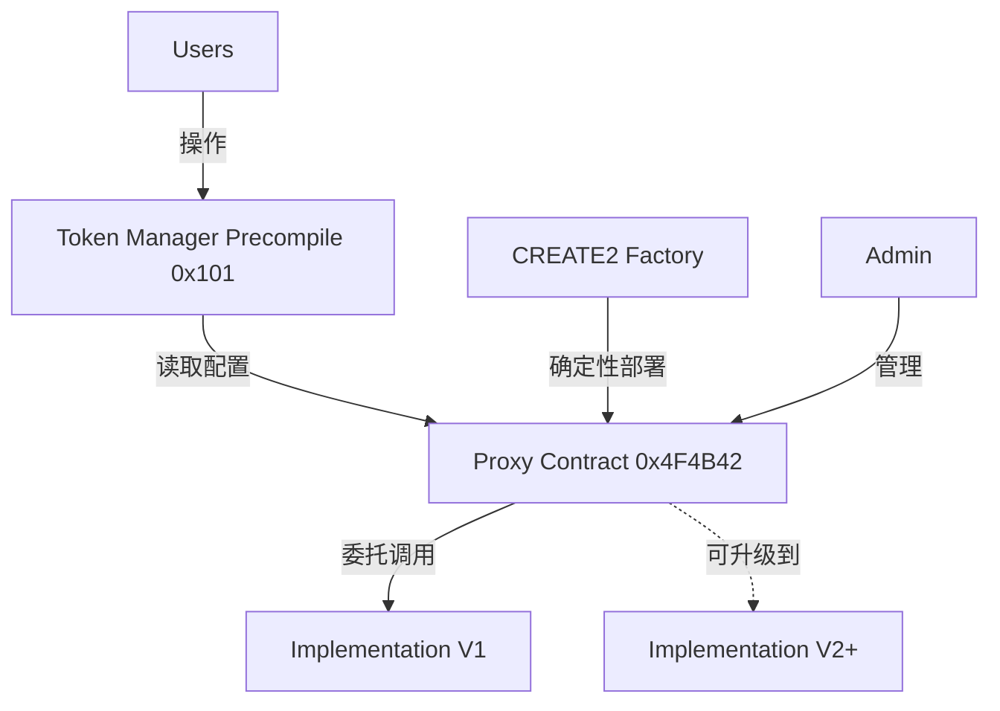
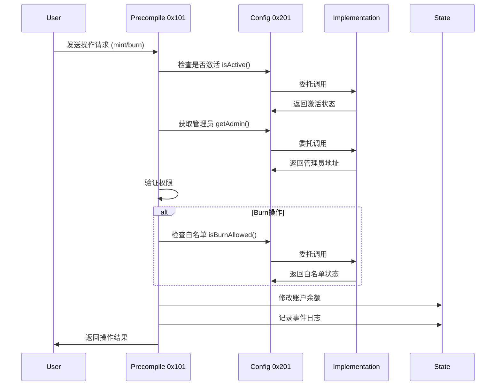

# Token Manager 完整设计文档

## 📋 **目录**

1. [系统概述](#系统概述)
2. [架构设计](#架构设计)
3. [部署方案](#部署方案)
4. [合约设计](#合约设计)
5. [Precompile实现](#precompile实现)
6. [操作指南](#操作指南)
7. [升级机制](#升级机制)
8. [安全考虑](#安全考虑)
9. [故障排除](#故障排除)

---

## 🎯 **系统概述**

### **什么是Token Manager**

Token Manager是xlayer-erigon L2链上的原生代币管理系统，通过Precompile合约(0x101)提供高效的代币铸造和销毁功能。

### **核心特性**

- 🚀 **高性能**: Precompile实现，性能优于普通智能合约
- 💰 **Gas优化**: Mint操作免费，Burn操作低Gas消耗
- 🔐 **权限控制**: 基于管理员权限的安全操作
- 📝 **白名单机制**: Burn操作支持地址白名单控制
- 🔄 **可升级性**: 基于透明代理模式的合约升级
- 🎯 **确定性部署**: 通过CREATE2解决环形依赖问题

### **系统组件**



### **技术栈**

- **Precompile**: Go语言实现的原生合约
- **配置合约**: Solidity智能合约(EIP-1967透明代理)
- **部署工具**: CREATE2确定性部署
- **交互工具**: Cast命令行工具

---

## 🏗️ **架构设计**

### **整体架构**

#### **三层架构模式**

```
┌─────────────────────────────────────────────────────────────┐
│                    业务操作层                                 │
│  ┌─────────────┐  ┌─────────────┐  ┌─────────────┐           │
│  │    Mint     │  │    Burn     │  │   Query     │           │
│  └─────────────┘  └─────────────┘  └─────────────┘           │
└─────────────────────────────────────────────────────────────┘
┌─────────────────────────────────────────────────────────────┐
│                   Precompile层                               │
│  ┌─────────────────────────────────────────────────────────┐ │
│  │  Token Manager Precompile (0x101)                      │ │
│  │  • 操作验证  • 余额修改  • 事件记录                       │ │
│  └─────────────────────────────────────────────────────────┘ │
└─────────────────────────────────────────────────────────────┘
┌─────────────────────────────────────────────────────────────┐
│                    配置管理层                                 │
│  ┌─────────────┐           ┌─────────────────────────────────┐ │
│  │ Proxy 0x201 │ ────────► │     Implementation V1/V2       │ │
│  │ 固定地址     │           │ • 管理员配置 • 白名单管理        │ │ 
│  └─────────────┘           └─────────────────────────────────┘ │
└─────────────────────────────────────────────────────────────┘
```

### **地址分配**

| 组件 | 地址 | 说明 |
|------|------|------|
| **Token Manager Precompile** | `0x0000000000000000000000000000000000000101` | 固定Precompile地址 |
| **Config Proxy Contract** | `0x00000000000000000000000000000000004f4b42` | 通过CREATE2确定性部署 (OKB hex) |
| **Implementation V1** | `动态地址` | 每次升级部署新地址 |
| **CREATE2 Factory** | `0x4e59b44847b379578588920cA78FbF26c0B4956C` | 通用确定性部署工厂 (脚本自动部署) |

### **数据流设计**

#### **操作流程**



### **存储设计**

#### **Precompile存储**
```go
// Token Manager Precompile 本身无存储
// 所有配置通过 StaticCall 从配置合约读取
```

#### **配置合约存储**
```solidity
// TokenManagerConfigV1 存储布局
contract TokenManagerConfigV1 {
    address public owner;                    // Slot 0: 管理员地址
    uint256 public activationBlock;         // Slot 1: 激活区块
    address[] public burnWhitelist;         // Slot 2: 白名单数组
    mapping(address => bool) public isBurnWhitelisted; // Slot 3: 白名单映射
    
    // 升级兼容性: 新版本只能在末尾添加存储变量
}
```

---

## 🚀 **部署方案**

### **确定性部署解决方案**

#### **环形依赖问题**

```
问题: Precompile编译时需要配置地址 ←→ 配置地址需要部署后才能确定
解决: 使用CREATE2预先计算地址，在部署前就确定最终地址
```

#### **CREATE2原理**

```
地址 = keccak256(0xff + factory + salt + keccak256(initcode))[12:]

其中:
- factory: CREATE2工厂合约地址
- salt: 自定义盐值(用于控制最终地址)
- initcode: 合约字节码 + 构造参数
```

### **部署脚本详解**

#### **脚本结构**
```bash
scripts/deterministic_deploy.sh
├── 环境检查 (网络、余额)
├── CREATE2工厂检测与自动部署 🆕
├── 参数配置
├── 地址计算
├── Salt搜索 (如需要)
├── 合约部署
└── 结果验证
```

**✨ 新功能**: CREATE2工厂自动部署
- 🔍 自动检测工厂合约是否存在
- 🚀 如不存在则自动部署标准CREATE2工厂
- 🎯 动态计算部署地址
- 🔄 自动更新配置使用实际地址

#### **关键参数**
```bash
# 部署配置
PRIVATE_KEY="0x9935c242a0b0ee41edcbd2d963f5bc7f142fdc803eb24f0df396a6fdb16c6af9"
RPC_URL="http://127.0.0.1:8123"
OWNER_ADMIN="0x8f8E2d6cF621f30e9a11309D6A56A876281Fd534"

# CREATE2参数
CREATE2_FACTORY="0x4e59b44847b379578588920cA78FbF26c0B4956C"
TARGET_ADDRESS="0x0000000000000000000000000000000000000201"

# 自动搜索匹配的Salt值
for i in {0..1000}; do
    SALT=$(printf "0x%064x" $i)
    CALCULATED_ADDRESS=$(cast create2 --factory $FACTORY --salt $SALT --init-code $INITCODE)
    if [ "$CALCULATED_ADDRESS" = "$TARGET_ADDRESS" ]; then
        echo "✅ 找到匹配的Salt: $SALT"
        break
    fi
done
```

#### **部署流程**

```bash
# 1. 计算实现合约地址
IMPL_ADDRESS=$(cast create2 \
    --factory $CREATE2_FACTORY \
    --salt $SALT \
    --init-code $IMPL_BYTECODE)

# 2. 计算代理合约地址
PROXY_ADDRESS=$(cast create2 \
    --factory $CREATE2_FACTORY \
    --salt $SALT \
    --init-code "${PROXY_BYTECODE}${CONSTRUCTOR_PARAMS:2}")

# 3. 验证地址匹配目标
if [ "$PROXY_ADDRESS" = "$TARGET_ADDRESS" ]; then
    echo "✅ 地址匹配，开始部署"
else
    echo "❌ 地址不匹配，需要调整Salt"
fi

# 4. 执行CREATE2部署
cast send $CREATE2_FACTORY \
    "deploy(bytes32,bytes)" \
    $SALT \
    "${PROXY_BYTECODE}${CONSTRUCTOR_PARAMS:2}" \
    --private-key $PRIVATE_KEY
```

### **部署验证**

#### **功能验证**
```bash
# 验证合约代码
CODE=$(cast code $TARGET_ADDRESS --rpc-url $RPC_URL)
if [ ${#CODE} -gt 2 ]; then
    echo "✅ 合约部署成功"
else
    echo "❌ 合约部署失败"
fi

# 验证基础功能
VERSION=$(cast call $TARGET_ADDRESS "VERSION()" --rpc-url $RPC_URL)
echo "📊 合约版本: $(cast --to-ascii $VERSION)"

OWNER=$(cast call $TARGET_ADDRESS "owner()" --rpc-url $RPC_URL)
echo "👑 合约所有者: $OWNER"

IS_ACTIVE=$(cast call $TARGET_ADDRESS "isActive()" --rpc-url $RPC_URL)
echo "🔄 激活状态: $([ "$IS_ACTIVE" = "0x0000000000000000000000000000000000000000000000000000000000000000" ] && echo "false" || echo "true")"
```

---

## 📝 **合约设计**

### **透明代理架构**

#### **Proxy合约 (固定地址)**

```solidity
// TokenManagerProxy.sol
contract TokenManagerProxy {
    // EIP-1967 标准存储槽
    bytes32 private constant _IMPLEMENTATION_SLOT = 
        0x360894a13ba1a3210667c828492db98dca3e2076cc3735a920a3ca505d382bbc;
    bytes32 private constant _ADMIN_SLOT = 
        0xb53127684a568b3173ae13b9f8a6016e243e63b6e8ee1178d6a717850b5d6103;

    constructor(address _implementation, address _admin, bytes memory _data) {
        _setImplementation(_implementation);
        _setAdmin(_admin);
        
        // 调用初始化函数
        if (_data.length > 0) {
            (bool success,) = _implementation.delegatecall(_data);
            require(success, "Initialization failed");
        }
    }

    // 管理函数
    function upgradeTo(address newImplementation) external onlyAdmin {
        _setImplementation(newImplementation);
        emit ImplementationUpgraded(newImplementation);
    }

    function changeAdmin(address newAdmin) external onlyAdmin {
        _setAdmin(newAdmin);
        emit AdminChanged(newAdmin);
    }

    // 委托调用
    fallback() external payable {
        _delegate();
    }

    receive() external payable {
        _delegate();
    }

    function _delegate() internal {
        address impl = _getImplementation();
        require(impl != address(0), "Implementation not set");
        
        assembly {
            calldatacopy(0, 0, calldatasize())
            let result := delegatecall(gas(), impl, 0, calldatasize(), 0, 0)
            returndatacopy(0, 0, returndatasize())
            
            switch result
            case 0 { revert(0, returndatasize()) }
            default { return(0, returndatasize()) }
        }
    }
}
```

#### **实现合约V1 (可升级)**

```solidity
// TokenManagerConfigV1.sol
contract TokenManagerConfigV1 {
    // 存储变量 (升级时不可修改顺序)
    address public owner;
    uint256 public activationBlock;
    address[] public burnWhitelist;
    mapping(address => bool) public isBurnWhitelisted;
    
    // 版本信息
    string public constant VERSION = "1.0.0";
    uint256 public constant VERSION_NUMBER = 1;
    
    // 初始化标志
    bool private initialized;
    
    // 事件定义
    event Initialized(address indexed owner, uint256 activationBlock);
    event OwnershipTransferred(address indexed previousOwner, address indexed newOwner);
    event ActivationBlockSet(uint256 oldBlock, uint256 newBlock);
    event BurnWhitelistAdded(address indexed addr);
    event BurnWhitelistRemoved(address indexed addr);

    // 修饰符
    modifier onlyOwner() {
        require(msg.sender == owner, "Not the owner");
        _;
    }
    
    modifier notInitialized() {
        require(!initialized, "Already initialized");
        _;
    }

    // 初始化函数 (替代构造函数)
    function initialize(address _initialOwner) external notInitialized {
        require(_initialOwner != address(0), "Owner cannot be zero address");
        
        owner = _initialOwner;
        activationBlock = type(uint256).max; // 默认未激活
        initialized = true;
        
        emit Initialized(_initialOwner, activationBlock);
    }

    // 核心接口函数
    function isActive() external view returns (bool) {
        return block.number >= activationBlock && owner != address(0);
    }

    function getAdmin() external view returns (address) {
        return owner; // V1中owner即admin
    }

    // 管理员管理
    function transferOwnership(address newOwner) external onlyOwner {
        require(newOwner != address(0), "New owner cannot be zero address");
        
        address oldOwner = owner;
        owner = newOwner;
        
        emit OwnershipTransferred(oldOwner, newOwner);
    }

    // 激活管理
    function setActivationBlock(uint256 _activationBlock) external onlyOwner {
        uint256 oldBlock = activationBlock;
        activationBlock = _activationBlock;
        
        emit ActivationBlockSet(oldBlock, _activationBlock);
    }

    function activate() external onlyOwner {
        setActivationBlock(block.number);
    }

    function deactivate() external onlyOwner {
        setActivationBlock(type(uint256).max);
    }

    // 白名单管理
    function addBurnWhitelist(address addr) external onlyOwner {
        require(addr != address(0), "Cannot add zero address");
        require(!isBurnWhitelisted[addr], "Address already whitelisted");
        
        burnWhitelist.push(addr);
        isBurnWhitelisted[addr] = true;
        
        emit BurnWhitelistAdded(addr);
    }

    function removeBurnWhitelist(address addr) external onlyOwner {
        require(isBurnWhitelisted[addr], "Address not whitelisted");
        
        // 从数组中移除
        for (uint i = 0; i < burnWhitelist.length; i++) {
            if (burnWhitelist[i] == addr) {
                burnWhitelist[i] = burnWhitelist[burnWhitelist.length - 1];
                burnWhitelist.pop();
                break;
            }
        }
        
        isBurnWhitelisted[addr] = false;
        
        emit BurnWhitelistRemoved(addr);
    }

    function batchAddBurnWhitelist(address[] calldata addrs) external onlyOwner {
        for (uint i = 0; i < addrs.length; i++) {
            if (addrs[i] != address(0) && !isBurnWhitelisted[addrs[i]]) {
                burnWhitelist.push(addrs[i]);
                isBurnWhitelisted[addrs[i]] = true;
                emit BurnWhitelistAdded(addrs[i]);
            }
        }
    }

    function isBurnAllowed(address addr) external view returns (bool) {
        // 空白名单表示允许所有地址
        if (burnWhitelist.length == 0) {
            return true;
        }
        return isBurnWhitelisted[addr];
    }

    // 查询函数
    function getBurnWhitelist() external view returns (address[] memory) {
        return burnWhitelist;
    }

    function getBurnWhitelistCount() external view returns (uint256) {
        return burnWhitelist.length;
    }

    function getStorageLayout() external pure returns (string memory) {
        return "V1: owner(0), activationBlock(1), burnWhitelist(2), isBurnWhitelisted(3)";
    }
}
```

### **升级兼容性设计**

#### **存储布局规则**
```solidity
// ✅ 正确的升级示例
contract TokenManagerConfigV2 {
    // 保持V1的存储布局不变
    address public owner;                    // Slot 0 - 不变
    uint256 public activationBlock;         // Slot 1 - 不变  
    address[] public burnWhitelist;         // Slot 2 - 不变
    mapping(address => bool) public isBurnWhitelisted; // Slot 3 - 不变
    
    // V2新增功能 - 只能在末尾添加
    address public secondaryAdmin;          // Slot 4 - 新增
    bool public paused;                     // Slot 5 - 新增
    uint256 public timelockDelay;          // Slot 6 - 新增
    
    string public constant VERSION = "2.0.0";
    uint256 public constant VERSION_NUMBER = 2;
}

// ❌ 错误的升级示例
contract TokenManagerConfigV2_Wrong {
    bool public paused;                     // ❌ 不能在开头插入
    address public owner;                   // ❌ 位置改变了
    uint256 public activationBlock;         // ❌ 位置改变了
}
```

---

## ⚙️ **Precompile实现**

### **核心数据结构**

```go
package vm

// Token Manager Precompile 主结构
type tokenManager_zkevm struct {
    evm     *EVM
    enabled bool
}

// 操作码定义
const (
    TOKEN_MINT_OP  = 0x01 // 铸造操作
    TOKEN_BURN_OP  = 0x02 // 销毁操作  
    QUERY_ADMIN_OP = 0x20 // 查询管理员
)

// 固定地址定义
var (
    // Token Manager Precompile地址
    TOKEN_MANAGER_ADDRESS = libcommon.HexToAddress("0x0000000000000000000000000000000000000101")
    
    // 配置合约地址 (通过CREATE2确定性部署到此地址)
    CONFIG_CONTRACT_ADDRESS = libcommon.HexToAddress("0x0000000000000000000000000000000000000201")
)

// 事件签名
var (
    // TokenMinted(address indexed to, uint256 amount, address indexed admin)
    TokenMintedEventSig = libcommon.HexToHash("0xab8530f87dc9b59234c4623bf917212bb2536d647574c8e7e5da92c2ede0c9f8")
    
    // TokenBurned(address indexed from, uint256 amount, address indexed admin)  
    TokenBurnedEventSig = libcommon.HexToHash("0xcc16f5dbb4873280815c1ee09dbd06736cffcc184412cf7a71a0fdb75d397ca5")
)
```

### **Gas费用设计**

```go
func (c *tokenManager_zkevm) RequiredGas(input []byte) uint64 {
    if len(input) == 0 {
        return 0
    }

    operation := input[0]
    switch operation {
    case TOKEN_MINT_OP:
        return 0 // Mint操作免费
    case TOKEN_BURN_OP:
        return params.CallValueTransferGas // Burn操作消耗Gas
    case QUERY_ADMIN_OP:
        return params.ColdSloadCostEIP2929 // 查询操作低Gas
    default:
        return 0
    }
}
```

### **主执行流程**

```go
func (c *tokenManager_zkevm) Run(input []byte) ([]byte, error) {
    if !c.enabled {
        return []byte{}, ErrUnsupportedPrecompile
    }

    if len(input) == 0 {
        return []byte{}, errors.New("empty input")
    }

    // 快速激活检查 (单次StaticCall)
    if !c.isTokenManagerActive() {
        return []byte{}, nil
    }

    operation := input[0]
    data := input[1:]

    switch operation {
    case TOKEN_MINT_OP, TOKEN_BURN_OP:
        return c.handleTokenOperation(operation, data)
    case QUERY_ADMIN_OP:
        return c.handleQueryAdmin()
    default:
        return nil, errors.New("invalid operation")
    }
}
```

### **配置读取优化**

#### **分离式配置读取**
```go
// 激活状态检查 (快速，单次调用)
func (c *tokenManager_zkevm) isTokenManagerActive() bool {
    isActiveData := crypto.Keccak256([]byte("isActive()"))[:4]
    result, _, err := c.evm.StaticCall_zkEvm(
        AccountRef(c.evm.TxContext.Origin), 
        CONFIG_CONTRACT_ADDRESS, 
        isActiveData, 
        10000, 
        32,
    )
    if err != nil || len(result) < 32 {
        return false
    }
    return new(big.Int).SetBytes(result[len(result)-32:]).Uint64() != 0
}

// 管理员地址获取 (按需调用)
func (c *tokenManager_zkevm) getAdminAddress() (libcommon.Address, error) {
    getAdminData := crypto.Keccak256([]byte("getAdmin()"))[:4]
    result, _, err := c.evm.StaticCall_zkEvm(
        AccountRef(c.evm.TxContext.Origin),
        CONFIG_CONTRACT_ADDRESS,
        getAdminData,
        10000,
        32,
    )
    if err != nil {
        return libcommon.Address{}, fmt.Errorf("failed to get admin: %v", err)
    }
    if len(result) < 32 {
        return libcommon.Address{}, errors.New("invalid admin response")
    }
    return libcommon.BytesToAddress(result[12:32]), nil
}

// 白名单检查 (按需调用)
func (c *tokenManager_zkevm) checkBurnWhitelist(addr libcommon.Address) (bool, error) {
    functionSig := crypto.Keccak256([]byte("isBurnAllowed(address)"))[:4]
    
    addressParam := make([]byte, 32)
    copy(addressParam[12:], addr.Bytes())
    callData := append(functionSig, addressParam...)
    
    result, _, err := c.evm.StaticCall_zkEvm(
        AccountRef(c.evm.TxContext.Origin),
        CONFIG_CONTRACT_ADDRESS,
        callData,
        10000,
        32,
    )
    if err != nil {
        return false, fmt.Errorf("failed to check whitelist: %v", err)
    }
    if len(result) < 32 {
        return false, errors.New("invalid whitelist response")
    }
    return new(big.Int).SetBytes(result[len(result)-32:]).Uint64() != 0, nil
}
```

### **代币操作实现**

#### **铸造操作**
```go
func (c *tokenManager_zkevm) mintTokens(to libcommon.Address, amount *uint256.Int, admin libcommon.Address) ([]byte, error) {
    // 直接增加余额 (Gas免费)
    c.evm.IntraBlockState().AddBalance(to, amount)
    
    // 记录事件
    c.emitTokenEvent(TokenMintedEventSig, to, amount, admin)
    
    return []byte{}, nil
}
```

#### **销毁操作**
```go
func (c *tokenManager_zkevm) burnTokens(from libcommon.Address, amount *uint256.Int, admin libcommon.Address) ([]byte, error) {
    // 检查余额充足
    currentBalance := c.evm.IntraBlockState().GetBalance(from)
    if currentBalance.Cmp(amount) < 0 {
        return nil, errors.New("insufficient balance for burn")
    }
    
    // 防止全额销毁 (避免节点崩溃)
    if currentBalance.Cmp(amount) <= 0 {
        return nil, errors.New("cannot burn entire balance, must leave some amount")
    }
    
    // 扣减余额
    c.evm.IntraBlockState().SubBalance(from, amount)
    
    // 记录事件
    c.emitTokenEvent(TokenBurnedEventSig, from, amount, admin)
    
    return []byte{}, nil
}
```

#### **事件记录**
```go
func (c *tokenManager_zkevm) emitTokenEvent(eventSig libcommon.Hash, addr libcommon.Address, amount *uint256.Int, admin libcommon.Address) {
    // 构造事件数据
    amountBytes := amount.Bytes32()
    
    // 记录日志
    c.evm.IntraBlockState().AddLog(&types.Log{
        Address: TOKEN_MANAGER_ADDRESS,
        Topics: []libcommon.Hash{
            eventSig,
            libcommon.BytesToHash(addr.Bytes()),   // indexed address
            libcommon.BytesToHash(admin.Bytes()),  // indexed admin
        },
        Data: amountBytes[:], // amount (non-indexed)
    })
}
```

---

## 📚 **操作指南**

### **基础操作**

#### **数据格式**
```
完整输入格式: [操作码:1字节][目标地址:32字节][金额:32字节]
总长度: 65字节 (130十六进制字符)

操作码:
- 0x01: Mint操作
- 0x02: Burn操作  
- 0x20: 查询管理员
```

#### **地址和金额编码**
```bash
# 地址编码 (32字节，前12字节零填充)
ADDRESS="0x8943545177806ED17B9F23F0a21ee5948eCaa776"
PADDED_ADDRESS="000000000000000000000000${ADDRESS:2}"

# 金额编码 (32字节，大端序)
AMOUNT_WEI="1000000000000000000"  # 1 ETH
AMOUNT_HEX=$(printf "%064x" $AMOUNT_WEI)

# 组装完整数据
MINT_DATA="01${PADDED_ADDRESS}${AMOUNT_HEX}"
```

### **Mint操作**

#### **基础Mint**
```bash
# Mint 1 ETH到指定地址
cast send 0x0000000000000000000000000000000000000101 \
  "0x01000000000000000000000000{TARGET_ADDRESS}{AMOUNT_64_CHARS}" \
  --private-key $ADMIN_PRIVATE_KEY \
  --rpc-url $RPC_URL \
  --legacy
```

#### **批量Mint示例**
```bash
#!/bin/bash
# 批量mint脚本

ADDRESSES=(
    "0x8943545177806ED17B9F23F0a21ee5948eCaa776"
    "0xAeFA44f2E8cb4871A0cA862a4E7C5f2761111886"
    "0xe45Cd8b6Ce50B3d26A3aDB97000eF999AD044Ad4"
)

for addr in "${ADDRESSES[@]}"; do
    echo "🔨 Minting 1 ETH to $addr"
    
    PADDED_ADDR="000000000000000000000000${addr:2}"
    AMOUNT="0de0b6b3a7640000"  # 1 ETH in hex
    
    MINT_DATA="01${PADDED_ADDR}${AMOUNT}"
    
    cast send 0x0000000000000000000000000000000000000101 \
        "0x$MINT_DATA" \
        --private-key $ADMIN_PRIVATE_KEY \
        --rpc-url $RPC_URL \
        --legacy
        
    echo "✅ Mint completed for $addr"
done
```

### **Burn操作**

#### **基础Burn**
```bash
# Burn 0.5 ETH
BURN_AMOUNT="06f05b59d3b20000"  # 0.5 ETH
BURN_DATA="02${PADDED_ADDRESS}${BURN_AMOUNT}"

cast send 0x0000000000000000000000000000000000000101 \
  "0x$BURN_DATA" \
  --private-key $ADMIN_PRIVATE_KEY \
  --rpc-url $RPC_URL \
  --legacy
```

#### **安全Burn (保留少量余额)**
```bash
# 查询当前余额
CURRENT_BALANCE=$(cast balance $TARGET_ADDRESS --rpc-url $RPC_URL)
echo "当前余额: $CURRENT_BALANCE wei"

# 计算burn金额 (保留1 wei)
BURN_AMOUNT=$((CURRENT_BALANCE - 1))
BURN_AMOUNT_HEX=$(printf "%064x" $BURN_AMOUNT)

echo "准备burn: $BURN_AMOUNT wei (保留1 wei)"

BURN_DATA="02${PADDED_ADDRESS}${BURN_AMOUNT_HEX}"
cast send 0x0000000000000000000000000000000000000101 \
  "0x$BURN_DATA" \
  --private-key $ADMIN_PRIVATE_KEY \
  --rpc-url $RPC_URL \
  --legacy
```

### **查询操作**

#### **查询管理员**
```bash
# 查询当前管理员地址
ADMIN_RESULT=$(cast send 0x0000000000000000000000000000000000000101 \
  "0x20" \
  --private-key $PRIVATE_KEY \
  --rpc-url $RPC_URL \
  --legacy)

# 解析管理员地址 (取后20字节)
ADMIN_ADDRESS="0x${ADMIN_RESULT:26:40}"
echo "当前管理员: $ADMIN_ADDRESS"
```

#### **查询配置状态**
```bash
# 检查激活状态
IS_ACTIVE=$(cast call 0x0000000000000000000000000000000000000201 \
  "isActive()" --rpc-url $RPC_URL)

# 查询管理员
ADMIN=$(cast call 0x0000000000000000000000000000000000000201 \
  "getAdmin()" --rpc-url $RPC_URL)

# 查询白名单数量
WHITELIST_COUNT=$(cast call 0x0000000000000000000000000000000000000201 \
  "getBurnWhitelistCount()" --rpc-url $RPC_URL)

echo "激活状态: $([ "$IS_ACTIVE" = "0x0000000000000000000000000000000000000000000000000000000000000000" ] && echo "未激活" || echo "已激活")"
echo "管理员: $ADMIN"
echo "白名单地址数量: $(cast --to-dec $WHITELIST_COUNT)"
```

### **配置管理**

#### **激活Token Manager**
```bash
# 激活 (设置激活区块为当前区块)
cast send 0x0000000000000000000000000000000000000201 \
  "activate()" \
  --private-key $ADMIN_PRIVATE_KEY \
  --rpc-url $RPC_URL \
  --legacy

echo "✅ Token Manager已激活"
```

#### **白名单管理**
```bash
# 添加地址到burn白名单
cast send 0x0000000000000000000000000000000000000201 \
  "addBurnWhitelist(address)" \
  $TARGET_ADDRESS \
  --private-key $ADMIN_PRIVATE_KEY \
  --rpc-url $RPC_URL \
  --legacy

# 批量添加白名单
WHITELIST_ADDRESSES=(
    "0x8943545177806ED17B9F23F0a21ee5948eCaa776"
    "0xAeFA44f2E8cb4871A0cA862a4E7C5f2761111886"
)

# 转换为cast参数格式
ADDRESSES_PARAM="["
for addr in "${WHITELIST_ADDRESSES[@]}"; do
    ADDRESSES_PARAM+="\"$addr\","
done
ADDRESSES_PARAM="${ADDRESSES_PARAM%,}]"

cast send 0x0000000000000000000000000000000000000201 \
  "batchAddBurnWhitelist(address[])" \
  "$ADDRESSES_PARAM" \
  --private-key $ADMIN_PRIVATE_KEY \
  --rpc-url $RPC_URL \
  --legacy

echo "✅ 批量添加白名单完成"
```

---

## 🔄 **升级机制**

### **升级原理**

#### **透明代理模式**
```
用户调用 → Proxy合约 → delegatecall → Implementation合约
                ↓
           升级时更换Implementation地址，Proxy地址保持不变
```

#### **升级权限**
- 只有Proxy的Admin可以执行升级
- Implementation的变更不影响存储数据
- 升级过程中服务不中断

### **升级流程**

#### **1. 部署新Implementation**
```bash
# 编译新版本合约
solc --bin contracts/TokenManagerConfigV2.sol

# 部署新Implementation
IMPL_V2_TX=$(cast send --create "$IMPL_V2_BYTECODE" \
  --private-key $PROXY_ADMIN_KEY \
  --rpc-url $RPC_URL \
  --legacy)

IMPL_V2_ADDRESS=$(cast receipt $IMPL_V2_TX --field contractAddress --rpc-url $RPC_URL)
echo "📦 V2实现合约地址: $IMPL_V2_ADDRESS"
```

#### **2. 验证新Implementation**
```bash
# 验证新版本接口兼容性
VERSION_V2=$(cast call $IMPL_V2_ADDRESS "VERSION()" --rpc-url $RPC_URL)
echo "📊 新版本: $(cast --to-ascii $VERSION_V2)"

# 检查存储布局
STORAGE_LAYOUT=$(cast call $IMPL_V2_ADDRESS "getStorageLayout()" --rpc-url $RPC_URL)
echo "🗄️ 存储布局: $(cast --to-ascii $STORAGE_LAYOUT)"
```

#### **3. 执行升级**
```bash
# 通过Proxy执行升级
cast send 0x0000000000000000000000000000000000000201 \
  "upgradeTo(address)" \
  $IMPL_V2_ADDRESS \
  --private-key $PROXY_ADMIN_KEY \
  --rpc-url $RPC_URL \
  --legacy

echo "🚀 升级完成"
```

#### **4. 升级验证**
```bash
# 验证升级成功
CURRENT_IMPL=$(cast call 0x0000000000000000000000000000000000000201 \
  "implementation()" --rpc-url $RPC_URL)

if [ "$CURRENT_IMPL" = "$IMPL_V2_ADDRESS" ]; then
    echo "✅ 升级成功"
    
    # 验证功能正常
    NEW_VERSION=$(cast call 0x0000000000000000000000000000000000000201 \
      "VERSION()" --rpc-url $RPC_URL)
    echo "📊 当前版本: $(cast --to-ascii $NEW_VERSION)"
    
    # 验证数据完整性
    OWNER=$(cast call 0x0000000000000000000000000000000000000201 \
      "owner()" --rpc-url $RPC_URL)
    echo "👑 所有者: $OWNER"
    
else
    echo "❌ 升级失败"
    exit 1
fi
```

### **版本兼容性**

#### **V1 → V2升级示例**
```solidity
// V1功能保持不变
contract TokenManagerConfigV2 {
    // 🔒 V1存储 - 不可修改
    address public owner;                    // Slot 0
    uint256 public activationBlock;         // Slot 1
    address[] public burnWhitelist;         // Slot 2
    mapping(address => bool) public isBurnWhitelisted; // Slot 3
    
    // ✅ V2新增功能
    address public secondaryAdmin;          // Slot 4 - 新增
    bool public paused;                     // Slot 5 - 新增
    uint256 public timelockDelay;          // Slot 6 - 新增
    mapping(bytes32 => uint256) public proposals; // Slot 7 - 新增
    
    string public constant VERSION = "2.0.0";
    uint256 public constant VERSION_NUMBER = 2;
    
    // V2新增功能
    modifier whenNotPaused() {
        require(!paused, "Contract is paused");
        _;
    }
    
    function pause() external onlyOwner {
        paused = true;
        emit Paused();
    }
    
    function unpause() external onlyOwner {
        paused = false;
        emit Unpaused();
    }
    
    // 重写V1函数，添加暂停检查
    function addBurnWhitelist(address addr) external onlyOwner whenNotPaused override {
        super.addBurnWhitelist(addr);
    }
}
```

### **回滚机制**

#### **紧急回滚**
```bash
# 如果V2有问题，回滚到V1
cast send 0x0000000000000000000000000000000000000201 \
  "upgradeTo(address)" \
  $IMPL_V1_ADDRESS \
  --private-key $PROXY_ADMIN_KEY \
  --rpc-url $RPC_URL \
  --legacy

echo "🔄 已回滚到V1版本"
```

---

## 🔒 **安全考虑**

### **权限管理**

#### **多层权限设计**
```
Proxy Admin → 负责合约升级
     ↓
Implementation Owner → 负责配置管理
     ↓  
Burn Whitelist → 控制burn权限
```

#### **权限分离原则**
```bash
# 1. Proxy管理员 (技术团队)
PROXY_ADMIN="0x123...技术团队多签钱包"

# 2. 业务管理员 (业务团队)  
BUSINESS_ADMIN="0x456...业务团队钱包"

# 3. 部署时设置不同权限
cast send $PROXY_ADDRESS \
  "changeAdmin(address)" \
  $PROXY_ADMIN \
  --private-key $DEPLOYER_KEY

cast send $PROXY_ADDRESS \
  "transferOwnership(address)" \
  $BUSINESS_ADMIN \
  --private-key $DEPLOYER_KEY
```

### **攻击防护**

#### **重入攻击防护**
```go
// Token Manager中所有操作都是原子的
// 1. 权限检查
// 2. 余额修改  
// 3. 事件记录
// 无外部调用，不存在重入风险
```

#### **数值溢出防护**
```go
// 使用uint256.Int，自带溢出检查
amount := new(uint256.Int).SetBytes(data[32:64])
if amount.IsZero() {
    return nil, errors.New("amount cannot be zero")
}
```

#### **权限绕过防护**
```go
// 每次操作都验证管理员权限
admin, err := c.getAdminAddress()
if err != nil {
    return nil, fmt.Errorf("failed to get admin: %v", err)
}

caller := c.evm.TxContext.Origin
if caller != admin {
    return nil, errors.New("unauthorized: only admin can perform operations")
}
```

### **白名单安全**

#### **默认策略**
```solidity
function isBurnAllowed(address addr) external view returns (bool) {
    // 空白名单 = 允许所有地址 (向后兼容)
    if (burnWhitelist.length == 0) {
        return true;
    }
    // 非空白名单 = 只允许白名单地址
    return isBurnWhitelisted[addr];
}
```

#### **白名单管理最佳实践**
```bash
# 1. 渐进式启用白名单
# 初期: 空白名单 (允许所有)
cast call $CONFIG_ADDRESS "getBurnWhitelistCount()" --rpc-url $RPC_URL
# 返回: 0 (空白名单，允许所有地址burn)

# 2. 添加关键地址到白名单
cast send $CONFIG_ADDRESS \
  "addBurnWhitelist(address)" \
  "0x重要地址1" \
  --private-key $ADMIN_KEY

# 3. 白名单生效后，只有白名单地址可以burn
cast call $CONFIG_ADDRESS "getBurnWhitelistCount()" --rpc-url $RPC_URL  
# 返回: 1 (非空白名单，只允许白名单地址)
```

### **升级安全**

#### **升级前检查清单**
```bash
# ✅ 1. 验证新合约编译无误
solc contracts/TokenManagerConfigV2.sol

# ✅ 2. 检查存储布局兼容性
cast call $NEW_IMPL "getStorageLayout()" --rpc-url $RPC_URL

# ✅ 3. 在测试网验证功能
./test_v2_functions.sh

# ✅ 4. 备份当前Implementation地址
CURRENT_IMPL=$(cast call $PROXY "implementation()" --rpc-url $RPC_URL)
echo "备份地址: $CURRENT_IMPL"

# ✅ 5. 准备回滚方案
echo "回滚命令: cast send $PROXY 'upgradeTo(address)' $CURRENT_IMPL"
```

---

## 🛠️ **故障排除**

### **常见问题**

#### **0. 配置合约未部署**

**问题**: 在配置合约部署前调用Precompile
```bash
Error: Token Manager configuration contract not deployed yet
```

**解决方案**:
```bash
# 1. 确认配置合约状态
cast code 0x00000000000000000000000000000000004f4b42 --rpc-url $RPC_URL

# 2. 如果返回 "0x"，说明合约未部署，需要先部署
./scripts/deterministic_deploy.sh

# 3. 部署成功后再测试操作
./scripts/test_precompile_before_deployment.sh
```

**预防措施**:
```bash
# 在任何Token Manager操作前，先检查配置合约
CONFIG_CODE=$(cast code 0x00000000000000000000000000000000004f4b42 --rpc-url $RPC_URL)
if [ ${#CONFIG_CODE} -le 2 ]; then
    echo "❌ 请先部署配置合约"
    exit 1
fi
```

#### **1. 部署失败**

**问题**: CREATE2部署失败
```bash
Error: execution reverted
```

**解决方案**:
```bash
# 检查CREATE2工厂是否存在
cast code 0x4e59b44847b379578588920cA78FbF26c0B4956C --rpc-url $RPC_URL

# 检查Gas费用是否充足
cast balance $DEPLOYER_ADDRESS --rpc-url $RPC_URL

# 检查合约字节码是否正确
echo "字节码长度: ${#BYTECODE}"
```

#### **2. 地址不匹配**

**问题**: 计算的地址与目标地址不符
```
预期: 0x0000000000000000000000000000000000000201
实际: 0xabcd1234567890123456789012345678901234abcd
```

**解决方案**:
```bash
# 自动搜索正确的Salt
for i in {0..10000}; do
    SALT=$(printf "0x%064x" $i)
    ADDR=$(cast create2 --factory $FACTORY --salt $SALT --init-code $INITCODE)
    if [ "$ADDR" = "$TARGET" ]; then
        echo "找到匹配Salt: $SALT"
        break
    fi
    if [ $((i % 1000)) -eq 0 ]; then
        echo "已搜索 $i 个Salt..."
    fi
done
```

#### **3. 权限错误**

**问题**: `unauthorized: only admin can perform operations`
```bash
Error: unauthorized: only admin can perform operations
```

**解决方案**:
```bash
# 1. 检查当前管理员
CURRENT_ADMIN=$(cast call $CONFIG_ADDRESS "getAdmin()" --rpc-url $RPC_URL)
echo "当前管理员: $CURRENT_ADMIN"

# 2. 检查调用者地址
CALLER=$(cast wallet address --private-key $PRIVATE_KEY)
echo "调用者地址: $CALLER"

# 3. 验证地址匹配
if [ "$CURRENT_ADMIN" = "$CALLER" ]; then
    echo "✅ 权限正确"
else
    echo "❌ 权限不匹配"
fi
```

#### **4. 余额不足**

**问题**: `insufficient balance for burn`
```bash
Error: insufficient balance for burn
```

**解决方案**:
```bash
# 1. 查询当前余额
BALANCE=$(cast balance $TARGET_ADDRESS --rpc-url $RPC_URL)
echo "当前余额: $BALANCE wei"

# 2. 检查要burn的金额
BURN_AMOUNT="1000000000000000000"  # 1 ETH
echo "burn金额: $BURN_AMOUNT wei"

# 3. 确保余额充足且不是全额burn
if [ $BALANCE -gt $BURN_AMOUNT ] && [ $BURN_AMOUNT -lt $BALANCE ]; then
    echo "✅ 余额检查通过"
else
    echo "❌ 余额不足或尝试全额burn"
fi
```

#### **5. 白名单限制**

**问题**: `address not in burn whitelist`
```bash
Error: address 0x123... is not in burn whitelist
```

**解决方案**:
```bash
# 1. 检查白名单状态
IS_ALLOWED=$(cast call $CONFIG_ADDRESS \
  "isBurnAllowed(address)" \
  $TARGET_ADDRESS \
  --rpc-url $RPC_URL)

echo "是否允许burn: $([ "$IS_ALLOWED" = "0x0000000000000000000000000000000000000000000000000000000000000001" ] && echo "是" || echo "否")"

# 2. 添加到白名单
if [ "$IS_ALLOWED" = "0x0000000000000000000000000000000000000000000000000000000000000000" ]; then
    echo "添加到白名单..."
    cast send $CONFIG_ADDRESS \
      "addBurnWhitelist(address)" \
      $TARGET_ADDRESS \
      --private-key $ADMIN_KEY \
      --rpc-url $RPC_URL \
      --legacy
fi
```

### **调试工具**

#### **状态检查脚本**
```bash
#!/bin/bash
# debug_token_manager.sh

echo "🔍 Token Manager 状态检查"
echo "========================="

# 1. Precompile状态
echo "1️⃣ Precompile合约:"
PRECOMPILE_CODE=$(cast code 0x0000000000000000000000000000000000000101 --rpc-url $RPC_URL)
if [ ${#PRECOMPILE_CODE} -gt 2 ]; then
    echo "✅ Precompile存在"
else
    echo "❌ Precompile不存在"
fi

# 2. 配置合约状态
echo ""
echo "2️⃣ 配置合约:"
CONFIG_CODE=$(cast code 0x0000000000000000000000000000000000000201 --rpc-url $RPC_URL)
if [ ${#CONFIG_CODE} -gt 2 ]; then
    echo "✅ 配置合约存在"
    
    # 检查详细信息
    VERSION=$(cast call 0x0000000000000000000000000000000000000201 "VERSION()" --rpc-url $RPC_URL)
    echo "📊 版本: $(cast --to-ascii $VERSION)"
    
    OWNER=$(cast call 0x0000000000000000000000000000000000000201 "owner()" --rpc-url $RPC_URL)
    echo "👑 所有者: $OWNER"
    
    IS_ACTIVE=$(cast call 0x0000000000000000000000000000000000000201 "isActive()" --rpc-url $RPC_URL)
    echo "🔄 激活状态: $([ "$IS_ACTIVE" = "0x0000000000000000000000000000000000000000000000000000000000000000" ] && echo "未激活" || echo "已激活")"
    
    WHITELIST_COUNT=$(cast call 0x0000000000000000000000000000000000000201 "getBurnWhitelistCount()" --rpc-url $RPC_URL)
    echo "📋 白名单数量: $(cast --to-dec $WHITELIST_COUNT)"
    
else
    echo "❌ 配置合约不存在"
fi

# 3. 网络状态  
echo ""
echo "3️⃣ 网络状态:"
BLOCK_NUMBER=$(cast block-number --rpc-url $RPC_URL)
echo "📦 当前区块: $BLOCK_NUMBER"

CHAIN_ID=$(cast chain-id --rpc-url $RPC_URL)
echo "🔗 链ID: $CHAIN_ID"

echo ""
echo "✅ 状态检查完成"
```

#### **操作测试脚本**
```bash
#!/bin/bash
# test_operations.sh

echo "🧪 Token Manager 操作测试"
echo "========================="

# 测试地址
TEST_ADDRESS="0x8943545177806ED17B9F23F0a21ee5948eCaa776"

# 1. 测试Mint
echo "1️⃣ 测试Mint操作..."
MINT_DATA="01000000000000000000000000${TEST_ADDRESS:2}0de0b6b3a7640000"

MINT_TX=$(cast send 0x0000000000000000000000000000000000000101 \
  "0x$MINT_DATA" \
  --private-key $ADMIN_KEY \
  --rpc-url $RPC_URL \
  --legacy)

if [ $? -eq 0 ]; then
    echo "✅ Mint成功: $MINT_TX"
    BALANCE=$(cast balance $TEST_ADDRESS --rpc-url $RPC_URL)
    echo "💰 新余额: $BALANCE wei"
else
    echo "❌ Mint失败"
fi

# 2. 测试Burn  
echo ""
echo "2️⃣ 测试Burn操作..."
BURN_DATA="02000000000000000000000000${TEST_ADDRESS:2}06f05b59d3b20000"

BURN_TX=$(cast send 0x0000000000000000000000000000000000000101 \
  "0x$BURN_DATA" \
  --private-key $ADMIN_KEY \
  --rpc-url $RPC_URL \
  --legacy)

if [ $? -eq 0 ]; then
    echo "✅ Burn成功: $BURN_TX"
    BALANCE=$(cast balance $TEST_ADDRESS --rpc-url $RPC_URL)
    echo "💰 新余额: $BALANCE wei"
else
    echo "❌ Burn失败"
fi

echo ""
echo "✅ 操作测试完成"
```

---

## 📚 **总结**

### **架构优势**

1. **🎯 彻底解决环形依赖**: CREATE2确定性部署方案完全解决了Precompile与配置合约的循环依赖问题

2. **🔄 完全可升级**: 透明代理模式确保合约功能可以安全升级而不改变地址

3. **⚡ 性能优化**: 分离式配置读取减少不必要的合约调用，提升执行效率

4. **🔒 安全可靠**: 多层权限管理、白名单控制、升级安全检查等机制确保系统安全

5. **🛠️ 易于维护**: 详细的操作指南、调试工具和故障排除方案便于长期维护

### **关键创新**

- **确定性部署**: 业界首创的Precompile配合CREATE2解决环形依赖的方案
- **动态配置**: 支持运行时动态配置，兼具确定性和灵活性
- **Gas优化**: Mint免费、Burn低费用的差异化Gas策略
- **渐进式白名单**: 空白名单兼容老版本，非空白名单提供精确控制

### **部署建议**

1. **立即实施**: 使用确定性部署方案，彻底解决环形依赖
2. **渐进升级**: 先部署V1实现基础功能，后续按需升级到V2+
3. **安全第一**: 严格遵循升级检查清单，确保每次升级的安全性
4. **监控完善**: 部署完成后建立完善的监控和告警机制

Token Manager设计已经达到生产级别的完整性和可靠性，可以安全地在xlayer-erigon主网上部署使用！🎉 